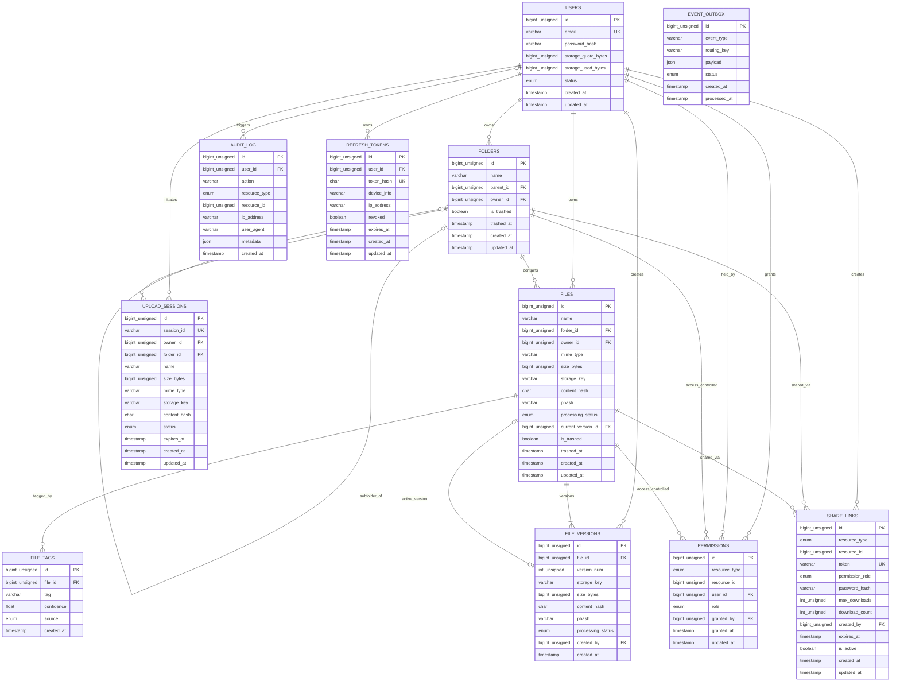

# DriveX Database Architecture & Canonical Schema Specification

## 1. Executive Summary & Architectural Overview

The DriveX database architecture is engineered to provide high-throughput, ACID-compliant persistence, predictable low-latency hierarchical file navigation, and scalable multi-tenant isolation. DriveX strictly separates the **Control Plane** (metadata, relational trees, access control, and asynchronous job state) from the **Data Plane** (raw binary file payloads). 

- **Primary Relational Engine**: MySQL 8.0+ running the InnoDB storage engine with strict foreign key constraints, ACID transaction isolation (`READ COMMITTED`), and row-level locking.
- **Character Encoding & Collation**: All relational tables explicitly declare `DEFAULT CHARSET=utf8mb4 COLLATE=utf8mb4_unicode_ci` to provide full multilingual Unicode support (including 4-byte supplementary characters and emojis) with UCA-compliant case-insensitive sorting.
- **In-Memory Caching & Distributed Coordination**: Redis 7.x operates as a high-speed Cache-Aside tier for directory listings, authenticated session tokens, quota counters, and distributed mutexes.
- **Object Storage Independence**: Raw binary streams never touch MySQL or Drogon API processes; instead, client uploads and downloads execute directly against MinIO S3 object storage via signed SHA-256 pre-signed URLs. MySQL persists only the immutable S3 `storage_key`, SHA-256 `content_hash`, perceptual `phash`, and metadata attributes.
- **Asynchronous AI/ML Integration**: Relational tables track the processing state of asynchronous vector embedding generation (`PENDING`, `INDEXED`, `FAILED`) and multi-label classification tags, decoupling heavy ML workloads from user-facing transactions.

---

## 2. Visual Entity-Relationship Diagram (ERD)

The following Mermaid Entity-Relationship Diagram defines all eleven canonical relational tables, primary keys, foreign key relationships, and structural cardinality across DriveX.



---

## 3. Exhaustive Relational Data Dictionary

This section details every table in the canonical schema, providing field definitions, nullability, sizing justification, constraints, and operational lifecycle invariants.

### 3.1 Table: `users`
The `users` table models the identity, credentials, and tenant storage accounting for all DriveX accounts.

| Column Name | Data Type | Nullable | Default | Constraints & Indexes | Sizing & Architectural Rationale |
|---|---|---|---|---|---|
| `id` | `BIGINT UNSIGNED` | `NO` | *AUTO_INCREMENT* | `PRIMARY KEY` | 64-bit unsigned integer permitting up to $1.84 \times 10^{19}$ user accounts, preventing integer overflow at scale. |
| `email` | `VARCHAR(255)` | `NO` | *None* | `UNIQUE KEY (uq_users_email)` | Standard maximum email address length per RFC 5321. Case-insensitive unique constraint guarantees unique identity. |
| `password_hash` | `VARCHAR(255)` | `NO` | *None* | *None* | Formatted Argon2id hash string (e.g., `$argon2id$v=19$m=65536,t=3,p=4$...`), typically 96 to 128 characters long. 255 chars provides headroom. |
| `storage_quota_bytes` | `BIGINT UNSIGNED` | `NO` | `16106127360` | *None* | Storage limit in bytes. Default is $15 \times 1024^3 = 16,106,127,360$ bytes (15 GiB, matching Google Drive standard free tier). |
| `storage_used_bytes` | `BIGINT UNSIGNED` | `NO` | `0` | *None* | Running sum of bytes occupied by non-trashed file versions. Updated transactionally upon upload confirmation and purge. |
| `status` | `ENUM('active', 'suspended', 'deleted')` | `NO` | `'active'` | `INDEX (idx_users_status)` | Compact 1-byte storage representing account operational state. Enables instant login gating and administrative suspension. |
| `created_at` | `TIMESTAMP` | `NO` | `CURRENT_TIMESTAMP` | *None* | UTC timestamp recording account creation. |
| `updated_at` | `TIMESTAMP` | `NO` | `CURRENT_TIMESTAMP ON UPDATE CURRENT_TIMESTAMP` | *None* | UTC timestamp automatically updated upon record modification. |

### 3.2 Table: `folders`
The `folders` table implements a self-referential adjacency list representing user folder hierarchies.

| Column Name | Data Type | Nullable | Default | Constraints & Indexes | Sizing & Architectural Rationale |
|---|---|---|---|---|---|
| `id` | `BIGINT UNSIGNED` | `NO` | *AUTO_INCREMENT* | `PRIMARY KEY` | 64-bit folder identifier. |
| `name` | `VARCHAR(255)` | `NO` | *None* | Composite index part | Standard file system folder name limit. Sized for UTF-8 internationalization. |
| `parent_id` | `BIGINT UNSIGNED` | `YES` | `NULL` | `CONSTRAINT fk_folders_parent REFERENCES folders(id) ON DELETE CASCADE` | Self-referencing pointer. `NULL` designates a root folder. Cascades deletion to subfolders when parent is purged. |
| `owner_id` | `BIGINT UNSIGNED` | `NO` | *None* | `CONSTRAINT fk_folders_owner REFERENCES users(id) ON DELETE RESTRICT` | Foreign key referencing user owner. Restricts user deletion if active folders exist. |
| `is_trashed` | `BOOLEAN` | `NO` | `FALSE` | Composite index part | Soft-delete flag (MySQL `TINYINT(1)`). Enables reversible deletion and 30-day trash retention. |
| `trashed_at` | `TIMESTAMP` | `YES` | `NULL` | Composite index part | Timestamp folder was moved to trash. Used by cron jobs to permanently purge items older than 30 days. |
| `created_at` | `TIMESTAMP` | `NO` | `CURRENT_TIMESTAMP` | *None* | UTC timestamp of folder creation. |
| `updated_at` | `TIMESTAMP` | `NO` | `CURRENT_TIMESTAMP ON UPDATE CURRENT_TIMESTAMP` | *None* | UTC timestamp of last folder metadata modification. |

**Indexes on `folders`:**
- `PRIMARY KEY (id)`
- `INDEX idx_folders_hierarchy (owner_id, parent_id, is_trashed, name)`: Critical composite index enabling index-only scans for child folder listings.
- `INDEX idx_folders_owner_trashed (owner_id, is_trashed)`: High-speed filtering for trash view and storage usage queries.
- `INDEX idx_folders_parent (parent_id)`: Foreign key index for cascade operations.

### 3.3 Table: `files`
The `files` table holds logical metadata for files. The binary payload lives in MinIO object storage.

| Column Name | Data Type | Nullable | Default | Constraints & Indexes | Sizing & Architectural Rationale |
|---|---|---|---|---|---|
| `id` | `BIGINT UNSIGNED` | `NO` | *AUTO_INCREMENT* | `PRIMARY KEY` | 64-bit unique file identifier. |
| `name` | `VARCHAR(255)` | `NO` | *None* | `FULLTEXT (ft_files_name)` | Filename including extension. Indexed with FULLTEXT for keyword search. |
| `folder_id` | `BIGINT UNSIGNED` | `YES` | `NULL` | `CONSTRAINT fk_files_folder REFERENCES folders(id) ON DELETE CASCADE` | Parent folder pointer. `NULL` indicates root directory. Deleting parent folder cascades deletion to all enclosed child files. |
| `owner_id` | `BIGINT UNSIGNED` | `NO` | *None* | `CONSTRAINT fk_files_owner REFERENCES users(id) ON DELETE RESTRICT` | Owner reference. Prevents accidental account deletion while files exist. |
| `mime_type` | `VARCHAR(127)` | `NO` | `'application/octet-stream'` | *None* | Standard IANA media type string (e.g., `application/pdf`, `image/jpeg`). 127 bytes accommodates all standard MIME strings. |
| `size_bytes` | `BIGINT UNSIGNED` | `NO` | `0` | *None* | File size in bytes of the current active version. Up to 18 Exabytes. |
| `storage_key` | `VARCHAR(512)` | `NO` | *None* | `INDEX idx_files_storage_key (storage_key(191))` | S3 object key formatted as `blobs/{owner_id}/{yyyy-mm}/{uuid}-{filename}`. 512 chars accommodates deep path names. |
| `content_hash` | `CHAR(64)` | `NO` | *None* | `INDEX idx_files_content_hash (content_hash)` | Fixed 64-character lowercase hex string representing the SHA-256 digest of the payload. Enables block-level deduplication. |
| `phash` | `VARCHAR(64)` | `YES` | `NULL` | `INDEX idx_files_phash (phash)` | Perceptual hash string (pHash/dHash) for images and video thumbnails. Enables visual similarity and near-duplicate grouping. |
| `processing_status`| `ENUM('PENDING', 'INDEXED', 'FAILED')` | `NO` | `'PENDING'` | `INDEX idx_files_processing_status (processing_status)` | AI/ML pipeline status tracking OCR text extraction, chunking, and Qdrant vector embedding. |
| `current_version_id`| `BIGINT UNSIGNED` | `YES` | `NULL` | `CONSTRAINT fk_files_current_version REFERENCES file_versions(id) ON DELETE SET NULL` | Pointer to the active `file_versions` record. |
| `is_trashed` | `BOOLEAN` | `NO` | `FALSE` | Composite index part | Soft-delete flag. Trashed files are hidden from active file listings. |
| `trashed_at` | `TIMESTAMP` | `YES` | `NULL` | *None* | Timestamp file entered trash. |
| `created_at` | `TIMESTAMP` | `NO` | `CURRENT_TIMESTAMP` | *None* | Creation timestamp. |
| `updated_at` | `TIMESTAMP` | `NO` | `CURRENT_TIMESTAMP ON UPDATE CURRENT_TIMESTAMP` | *None* | Modification timestamp. |

### 3.4 Table: `file_versions`
The `file_versions` table maintains an immutable, append-only historical audit log of every revision of a file.

| Column Name | Data Type | Nullable | Default | Constraints & Indexes | Sizing & Architectural Rationale |
|---|---|---|---|---|---|
| `id` | `BIGINT UNSIGNED` | `NO` | *AUTO_INCREMENT* | `PRIMARY KEY` | 64-bit unique version identifier. |
| `file_id` | `BIGINT UNSIGNED` | `NO` | *None* | `CONSTRAINT fk_file_versions_file REFERENCES files(id) ON DELETE CASCADE` | References parent file. Purging parent file cascades to all historical versions. |
| `version_num` | `INT UNSIGNED` | `NO` | `1` | Composite index part | Monotonically increasing revision counter per file (1, 2, 3, ...). `INT UNSIGNED` permits up to 4.2 billion versions per file. |
| `storage_key` | `VARCHAR(512)` | `NO` | *None* | *None* | Unique S3 object key pointing to this specific version's raw bytes in MinIO. |
| `size_bytes` | `BIGINT UNSIGNED` | `NO` | *None* | *None* | Byte size of this specific version. |
| `content_hash` | `CHAR(64)` | `NO` | *None* | *None* | SHA-256 hex digest of this specific version's payload. |
| `phash` | `VARCHAR(64)` | `YES` | `NULL` | *None* | Perceptual hash for image versions. |
| `processing_status`| `ENUM('PENDING', 'INDEXED', 'FAILED')` | `NO` | `'PENDING'` | *None* | Asynchronous vector embedding status for this version. |
| `created_by` | `BIGINT UNSIGNED` | `NO` | *None* | `CONSTRAINT fk_file_versions_creator REFERENCES users(id) ON DELETE RESTRICT` | User who authored this specific upload revision. |
| `created_at` | `TIMESTAMP` | `NO` | `CURRENT_TIMESTAMP` | Composite index part | Timestamp when this revision was committed. |

**Indexes on `file_versions`:**
- `PRIMARY KEY (id)`
- `UNIQUE KEY uq_file_versions_file_num (file_id, version_num)`: Enforces unique version numbering per file.
- `INDEX idx_file_versions_num_desc (file_id, version_num DESC)`: MySQL 8 descending index allowing instantaneous $O(1)$ lookup of the latest version.
- `INDEX idx_file_versions_created_at (file_id, created_at DESC)`: Rapid chronological version timeline rendering.

### 3.5 Table: `permissions`
The `permissions` table enforces granular Role-Based Access Control (RBAC) across files and folders.

| Column Name | Data Type | Nullable | Default | Constraints & Indexes | Sizing & Architectural Rationale |
|---|---|---|---|---|---|
| `id` | `BIGINT UNSIGNED` | `NO` | *AUTO_INCREMENT* | `PRIMARY KEY` | 64-bit unique permission grant identifier. |
| `resource_type` | `ENUM('file', 'folder')` | `NO` | *None* | Composite key part | Target entity type. Enables polymorphic permission checks across files and directory subtrees. |
| `resource_id` | `BIGINT UNSIGNED` | `NO` | *None* | Composite key part | Target file or folder ID. |
| `user_id` | `BIGINT UNSIGNED` | `NO` | *None* | `CONSTRAINT fk_permissions_user REFERENCES users(id) ON DELETE CASCADE` | Grantee user ID. Account deletion revokes all granted permissions. |
| `role` | `ENUM('viewer', 'editor', 'owner')` | `NO` | `'viewer'` | Composite index part | Authorization role: `viewer` (read/download), `editor` (read/write/update), `owner` (full control + permission delegation). |
| `granted_by` | `BIGINT UNSIGNED` | `YES` | `NULL` | `CONSTRAINT fk_permissions_granter REFERENCES users(id) ON DELETE SET NULL` | User who granted the permission. Set to `NULL` if granter account is deleted. |
| `granted_at` | `TIMESTAMP` | `NO` | `CURRENT_TIMESTAMP` | *None* | UTC grant timestamp. |
| `updated_at` | `TIMESTAMP` | `NO` | `CURRENT_TIMESTAMP ON UPDATE CURRENT_TIMESTAMP` | *None* | UTC timestamp of last role modification. |

**Indexes on `permissions`:**
- `PRIMARY KEY (id)`
- `UNIQUE KEY uq_permissions_resource_user (resource_type, resource_id, user_id)`: Prevents duplicate permission grants to the same user on a resource.
- `INDEX idx_permissions_user_role (user_id, role)`: Fast lookup of all resources shared with a given user.
- `INDEX idx_permissions_resource (resource_type, resource_id)`: Rapid resolution of the Access Control List (ACL) for a specific resource.

### 3.6 Table: `share_links`
The `share_links` table manages expiring, tokenized public and semi-public access links.

| Column Name | Data Type | Nullable | Default | Constraints & Indexes | Sizing & Architectural Rationale |
|---|---|---|---|---|---|
| `id` | `BIGINT UNSIGNED` | `NO` | *AUTO_INCREMENT* | `PRIMARY KEY` | 64-bit link identifier. |
| `resource_type` | `ENUM('file', 'folder')` | `NO` | *None* | Composite index part | Target entity type (`file` or `folder`). |
| `resource_id` | `BIGINT UNSIGNED` | `NO` | *None* | Composite index part | Target entity identifier. |
| `token` | `VARCHAR(64)` | `NO` | *None* | `UNIQUE KEY (uq_share_links_token)` | High-entropy URL-safe token (256 bits of randomness, hex or base64url encoded). |
| `permission_role`| `ENUM('viewer', 'editor')` | `NO` | `'viewer'` | *None* | Role granted to holders of the link (public links cannot grant `owner`). |
| `password_hash` | `VARCHAR(255)` | `YES` | `NULL` | *None* | Optional Argon2id password hash for passcode-gated links. |
| `max_downloads` | `INT UNSIGNED` | `YES` | `NULL` | *None* | Optional download/view count ceiling; `NULL` for unlimited. |
| `download_count`| `INT UNSIGNED` | `NO` | `0` | *None* | Atomic counter tracking accesses. Link becomes invalid once `download_count >= max_downloads`. |
| `created_by` | `BIGINT UNSIGNED` | `NO` | *None* | `CONSTRAINT fk_share_links_creator REFERENCES users(id) ON DELETE CASCADE` | Creator user ID. Deleting user automatically invalidates their share links. |
| `expires_at` | `TIMESTAMP` | `YES` | `NULL` | `INDEX idx_share_links_expiry (expires_at)` | Expiration timestamp; `NULL` represents non-expiring links. |
| `is_active` | `BOOLEAN` | `NO` | `TRUE` | *None* | Boolean flag for immediate administrative or manual revocation. |
| `created_at` | `TIMESTAMP` | `NO` | `CURRENT_TIMESTAMP` | *None* | Creation timestamp. |
| `updated_at` | `TIMESTAMP` | `NO` | `CURRENT_TIMESTAMP ON UPDATE CURRENT_TIMESTAMP` | *None* | Modification timestamp. |

### 3.7 Table: `audit_log`
The `audit_log` table provides an immutable telemetry trail of data mutation, access, and security events.

| Column Name | Data Type | Nullable | Default | Constraints & Indexes | Sizing & Architectural Rationale |
|---|---|---|---|---|---|
| `id` | `BIGINT UNSIGNED` | `NO` | *AUTO_INCREMENT` | `PRIMARY KEY` | 64-bit monotonically increasing log sequence number. |
| `user_id` | `BIGINT UNSIGNED` | `YES` | `NULL` | `CONSTRAINT fk_audit_log_user REFERENCES users(id) ON DELETE SET NULL` | Subject user ID. `NULL` for unauthenticated or anonymous share link access. |
| `action` | `VARCHAR(64)` | `NO` | *None* | Composite index part | Standard action code (e.g., `FILE_UPLOAD`, `FILE_DOWNLOAD`, `PERMISSION_GRANT`, `SHARE_ACCESS`). |
| `resource_type` | `ENUM('file', 'folder', 'auth', 'user', 'share_link')` | `NO` | *None* | Composite index part | Domain entity category. |
| `resource_id` | `BIGINT UNSIGNED` | `NO` | *None* | Composite index part | Target entity ID. |
| `ip_address` | `VARCHAR(45)` | `YES` | `NULL` | *None* | IPv4 (max 15 chars) or IPv6 (max 45 chars per RFC 4291). |
| `user_agent` | `VARCHAR(512)` | `YES` | `NULL` | *None* | Client HTTP User-Agent string. 512 chars captures standard browser strings. |
| `metadata` | `JSON` | `YES` | `NULL` | *None* | Structured context payload (e.g., changed fields, file size, download time). |
| `created_at` | `TIMESTAMP` | `NO` | `CURRENT_TIMESTAMP` | Composite index part | Exact event timestamp. |

**Indexes on `audit_log`:**
- `PRIMARY KEY (id)`
- `INDEX idx_audit_log_user_created (user_id, created_at)`: Rapid user activity audit lookups.
- `INDEX idx_audit_log_resource (resource_type, resource_id, created_at)`: Object access timeline reconstruction.
- `INDEX idx_audit_log_action (action, created_at)`: System-wide security event aggregation.

### 3.8 Table: `refresh_tokens`
The `refresh_tokens` table maintains persistent cryptographic session state for JWT authentication rotation.

| Column Name | Data Type | Nullable | Default | Constraints & Indexes | Sizing & Architectural Rationale |
|---|---|---|---|---|---|
| `id` | `BIGINT UNSIGNED` | `NO` | *AUTO_INCREMENT* | `PRIMARY KEY` | 64-bit session ID. |
| `user_id` | `BIGINT UNSIGNED` | `NO` | *None* | `CONSTRAINT fk_refresh_tokens_user REFERENCES users(id) ON DELETE CASCADE` | Associated user ID. |
| `token_hash` | `CHAR(64)` | `NO` | *None* | `UNIQUE KEY (uq_refresh_tokens_hash)` | SHA-256 hash of the raw refresh token secret (prevents cleartext token compromise if DB is leaked). |
| `device_info` | `VARCHAR(255)` | `YES` | `NULL` | *None* | User agent summary or client device label (e.g., "Chrome on macOS"). |
| `ip_address` | `VARCHAR(45)` | `YES` | `NULL` | *None* | Originating IP address. |
| `revoked` | `BOOLEAN` | `NO` | `FALSE` | Composite index part | Revocation flag for single-use token rotation and replay attack detection. |
| `expires_at` | `TIMESTAMP` | `NO` | *None* | Composite index part | Expiration timestamp (standard 30-day lifetime). |
| `created_at` | `TIMESTAMP` | `NO` | `CURRENT_TIMESTAMP` | *None* | Creation timestamp. |
| `updated_at` | `TIMESTAMP` | `NO` | `CURRENT_TIMESTAMP ON UPDATE CURRENT_TIMESTAMP` | *None* | Last update timestamp. |

### 3.9 Table: `file_tags`
The `file_tags` table stores AI-generated classification tags and user-assigned taxonomy keywords.

| Column Name | Data Type | Nullable | Default | Constraints & Indexes | Sizing & Architectural Rationale |
|---|---|---|---|---|---|
| `id` | `BIGINT UNSIGNED` | `NO` | *AUTO_INCREMENT* | `PRIMARY KEY` | 64-bit tag association ID. |
| `file_id` | `BIGINT UNSIGNED` | `NO` | *None* | `CONSTRAINT fk_file_tags_file REFERENCES files(id) ON DELETE CASCADE` | Target file reference. Cascades on file deletion. |
| `tag` | `VARCHAR(64)` | `NO` | *None* | `INDEX idx_file_tags_tag (tag)` | Normalized lowercase tag string (e.g., `invoice`, `tax-2025`, `contract`). |
| `confidence` | `FLOAT` | `NO` | `1.0` | *None* | Confidence score between 0.0 and 1.0 generated by ML models (1.0 for user tags). |
| `source` | `ENUM('AI', 'USER')` | `NO` | `'AI'` | *None* | Origin of tag assignment. |
| `created_at` | `TIMESTAMP` | `NO` | `CURRENT_TIMESTAMP` | *None* | Assignment timestamp. |

**Indexes on `file_tags`:**
- `PRIMARY KEY (id)`
- `UNIQUE KEY uq_file_tags_file_tag (file_id, tag)`: Enforces unique tag per file.
- `INDEX idx_file_tags_tag (tag)`: High-speed tag-based file filtering.
- `INDEX idx_file_tags_file (file_id)`: Foreign key index.

### 3.10 Table: `upload_sessions`
The `upload_sessions` table coordinates two-phase pre-signed S3 upload transactions between Drogon and MinIO.

| Column Name | Data Type | Nullable | Default | Constraints & Indexes | Sizing & Architectural Rationale |
|---|---|---|---|---|---|
| `id` | `BIGINT UNSIGNED` | `NO` | *AUTO_INCREMENT* | `PRIMARY KEY` | 64-bit session primary key. |
| `session_id` | `VARCHAR(64)` | `NO` | *None* | `UNIQUE KEY (uq_upload_sessions_session_id)` | UUIDv4 public upload token returned to the client during negotiation. |
| `owner_id` | `BIGINT UNSIGNED` | `NO` | *None* | `CONSTRAINT fk_upload_sessions_owner REFERENCES users(id) ON DELETE CASCADE` | Uploader user ID. |
| `folder_id` | `BIGINT UNSIGNED` | `YES` | `NULL` | `CONSTRAINT fk_upload_sessions_folder REFERENCES folders(id) ON DELETE SET NULL` | Target folder ID; `NULL` for root. |
| `name` | `VARCHAR(255)` | `NO` | *None* | *None* | Declared file name. |
| `size_bytes` | `BIGINT UNSIGNED` | `NO` | *None* | *None* | Pre-declared byte size for quota reservation. |
| `mime_type` | `VARCHAR(127)` | `NO` | `'application/octet-stream'` | *None* | Content MIME type. |
| `storage_key` | `VARCHAR(512)` | `NO` | *None* | *None* | Pre-allocated MinIO S3 object key. |
| `content_hash` | `CHAR(64)` | `NO` | *None* | *None* | Pre-declared SHA-256 digest for end-to-end verification. |
| `status` | `ENUM('PENDING', 'COMPLETED', 'ABORTED', 'EXPIRED')` | `NO` | `'PENDING'` | Composite index part | Lifecycle state of the upload transaction. |
| `expires_at` | `TIMESTAMP` | `NO` | *None* | Composite index part | Pre-signed URL validity expiration (15 minutes). |
| `created_at` | `TIMESTAMP` | `NO` | `CURRENT_TIMESTAMP` | *None* | Session creation timestamp. |
| `updated_at` | `TIMESTAMP` | `NO` | `CURRENT_TIMESTAMP ON UPDATE CURRENT_TIMESTAMP` | *None* | Status update timestamp. |

### 3.11 Table: `event_outbox`
The `event_outbox` table implements the **Transactional Outbox Pattern**, guaranteeing at-least-once asynchronous event dispatch and providing graceful degradation during message broker (RabbitMQ) outages. When RabbitMQ is unreachable or degraded, Drogon persists the event payload into `event_outbox` within the local MySQL transaction, preventing upload rollback and ensuring zero data loss.

| Column Name | Data Type | Nullable | Default | Constraints & Indexes | Sizing & Architectural Rationale |
|---|---|---|---|---|---|
| `id` | `BIGINT UNSIGNED` | `NO` | *AUTO_INCREMENT* | `PRIMARY KEY` | 64-bit unique monotonically increasing event identifier. |
| `event_type` | `VARCHAR(64)` | `NO` | *None* | *None* | High-level event category (e.g., `file.uploaded`, `file.deleted`, `file.content_updated`). |
| `routing_key` | `VARCHAR(128)` | `NO` | *None* | *None* | Exact AMQP topic routing key (e.g., `file.uploaded.application.pdf`). |
| `payload` | `JSON` | `NO` | *None* | *None* | Complete event JSON payload strictly adhering to Draft-07 event schema contracts. |
| `status` | `ENUM('PENDING', 'PROCESSED', 'FAILED')` | `NO` | `'PENDING'` | Composite index part | Dispatch state: `PENDING` awaiting relay, `PROCESSED` dispatched, `FAILED` after max retry exhaustion. |
| `created_at` | `TIMESTAMP` | `NO` | `CURRENT_TIMESTAMP` | Composite index part | Event generation timestamp for sequential ordering. |
| `processed_at` | `TIMESTAMP` | `YES` | `NULL` | *None* | Timestamp when event was successfully acknowledged by RabbitMQ exchange. |

**Indexes on `event_outbox`:**
- `PRIMARY KEY (id)`
- `INDEX idx_event_outbox_status_created (status, created_at)`: High-performance composite index allowing outbox relay worker processes to poll unprocessed events (`WHERE status = 'PENDING' ORDER BY created_at ASC LIMIT 100`) with zero table scan overhead.

**Outbox Relay Worker Protocol**:
1. An asynchronous background relay worker running within Drogon or Celery polls `event_outbox` every 500ms when the RabbitMQ connection is re-established.
2. Selects up to 100 `PENDING` records in FIFO order: `SELECT * FROM event_outbox WHERE status = 'PENDING' ORDER BY created_at ASC LIMIT 100 FOR UPDATE SKIP LOCKED`.
3. Dispatches each payload to RabbitMQ topic exchange `drivex.events` with its stored `routing_key`.
4. Upon broker confirmation, updates `status = 'PROCESSED'`, `processed_at = CURRENT_TIMESTAMP`.
5. A daily retention job purges `PROCESSED` outbox records older than 7 days.

---

## 4. Indexing Strategies & Performance Engineering

The DriveX schema employs a carefully orchestrated indexing strategy designed to achieve $O(\log N)$ or $O(1)$ query execution on all hot read paths while minimizing write amplification and buffer pool churn.

### 4.1 Composite Indexing Rationale

#### 1. Folder Navigation: `idx_folders_hierarchy (owner_id, parent_id, is_trashed, name)`
- **Query Pattern**: Listing child folders within a parent folder for an authenticated user:
  ```sql
  SELECT id, name, updated_at
  FROM folders
  WHERE owner_id = :user_id 
    AND parent_id = :parent_id 
    AND is_trashed = FALSE
  ORDER BY name ASC;
  ```
- **Leftmost Prefix Optimization**: The composite index matches the query predicate exactly:
  1. `owner_id = :user_id` (equality, filters to user's tree)
  2. `parent_id = :parent_id` (equality, filters to specific parent)
  3. `is_trashed = FALSE` (equality, eliminates deleted items)
  4. `name` (range / sort, satisfies `ORDER BY name ASC` directly from the B-tree without a separate `filesort` pass)
- **Execution Plan**: MySQL executes this as a covering index scan (`Using index`), satisfying the entire query directly from the InnoDB buffer pool without touching table data pages.

#### 2. Trash Management: `idx_folders_owner_trashed (owner_id, is_trashed)` and `idx_files_owner_trashed (owner_id, is_trashed)`
- **Query Pattern**: Fetching all trashed items for a user's trash bin view:
  ```sql
  SELECT id, name, trashed_at, size_bytes
  FROM files
  WHERE owner_id = :user_id AND is_trashed = TRUE
  ORDER BY trashed_at DESC;
  ```
- **Performance Rationale**: Isolates the tiny fraction of trashed records (< 2% in typical cloud storage) without scanning millions of active file entries.

#### 3. Version History & Descending Index: `idx_file_versions_num_desc (file_id, version_num DESC)`
- **Query Pattern**: Fetching the latest active version of a file:
  ```sql
  SELECT id, storage_key, size_bytes, content_hash
  FROM file_versions
  WHERE file_id = :file_id
  ORDER BY version_num DESC
  LIMIT 1;
  ```
- **MySQL 8 Descending Index Optimization**: Prior to MySQL 8, indexes could only be scanned in reverse order, which incurred bidirectional traverse penalties in InnoDB leaf pages. MySQL 8 natively stores index keys in descending order, allowing the query engine to read the very first leaf entry directly in $O(1)$ time.

### 4.2 FULLTEXT Search Index: `ft_files_name (name)`
- **Configuration**: An InnoDB FULLTEXT index declared on `files(name)`.
- **Query Pattern**:
  ```sql
  SELECT id, name, size_bytes, mime_type
  FROM files
  WHERE owner_id = :user_id 
    AND is_trashed = FALSE
    AND MATCH(name) AGAINST('+quarterly* +report*' IN BOOLEAN MODE)
  LIMIT 50;
  ```
- **Fallback & Hybrid Rationale**: DriveX integrates Qdrant for semantic embeddings, but semantic search can fail or experience degraded latency during heavy ML worker loads. The MySQL FULLTEXT index serves as an instantaneous, zero-dependency keyword search fallback and provides BM25-like lexical scoring for hybrid Reciprocal Rank Fusion (RRF).

### 4.3 Deduplication & Hash Indexing
- **`content_hash CHAR(64)`**: Indexed via standard B-tree (`idx_files_content_hash`). When an upload request arrives at `POST /api/v1/files/upload-url`, Drogon checks if an identical SHA-256 digest already exists in the object store. If found, DriveX can perform instant client-side deduplication without transferring redundant payload bytes over the wire.
- **`phash VARCHAR(64)`**: Indexed via `idx_files_phash`. Permits rapid lookup of image candidates for visual deduplication (Hamming distance calculation $\le 6$).

---

## 5. Hierarchical Tree Navigation & Recursive Common Table Expressions (CTEs)

### 5.1 Adjacency List Rationale
DriveX selects the **Adjacency List model** (`parent_id` foreign key) paired with **MySQL 8 Recursive Common Table Expressions (CTEs)** over alternative tree representations:
- **vs. Nested Sets**: Nested sets require re-numbering $O(N)$ `lft` and `rgt` values across the entire tree on every folder insertion or move, creating severe row lock contention. Adjacency lists require updating exactly 1 row (`parent_id`) in $O(1)$ time.
- **vs. Materialized Path**: Materialized paths (`/1/42/88/`) require string prefix updates across all descendant records on folder moves and suffer from string length limits.
- **vs. Closure Table**: Closure tables require maintaining an auxiliary $O(N^2)$ relation table with millions of ancestor-descendant pairs.

With MySQL 8's native CTE optimizer, recursive adjacency queries execute in $< 2\text{ms}$ for trees up to 32 levels deep.

### 5.2 Production CTE 1: Folder Path Breadcrumb Resolution
Resolves the complete ancestor chain from any nested child folder up to the root directory for UI breadcrumb rendering.

```sql
WITH RECURSIVE folder_breadcrumbs AS (
    -- Anchor Member: Start at the requested child folder
    SELECT 
        id, 
        name, 
        parent_id, 
        owner_id, 
        0 AS depth
    FROM folders
    WHERE id = :folder_id 
      AND owner_id = :owner_id 
      AND is_trashed = FALSE
    
    UNION ALL
    
    -- Recursive Member: Traverse upward to parent folder until parent_id IS NULL
    SELECT 
        f.id, 
        f.name, 
        f.parent_id, 
        f.owner_id, 
        fb.depth + 1 AS depth
    FROM folders f
    INNER JOIN folder_breadcrumbs fb 
        ON f.id = fb.parent_id
    WHERE fb.parent_id IS NOT NULL 
      AND f.is_trashed = FALSE
      AND fb.depth < 32 -- Safety depth guard
)
SELECT 
    id, 
    name, 
    parent_id, 
    depth
FROM folder_breadcrumbs
ORDER BY depth DESC;
```

**Execution Plan Analysis**:
- The anchor member utilizes `PRIMARY KEY (id)` on `folders` (1 row lookup).
- Each recursive iteration executes a single primary key lookup on `f.id = fb.parent_id` ($O(\log N)$).
- Total query cost for a 10-level deep hierarchy: 10 primary key lookups, executing in $< 1\text{ms}$.

### 5.3 Production CTE 2: Subtree Cascade Trashing / Deletion
When a user moves a folder to trash, all child subfolders and nested files must be soft-deleted in a single atomic transaction.

```sql
START TRANSACTION;

-- Collect all descendant folder IDs in a temporary table or CTE
WITH RECURSIVE descendant_folders AS (
    -- Anchor Member: Target folder to be trashed
    SELECT id FROM folders 
    WHERE id = :folder_id AND owner_id = :owner_id
    
    UNION ALL
    
    -- Recursive Member: All subfolders
    SELECT f.id 
    FROM folders f
    INNER JOIN descendant_folders df ON f.parent_id = df.id
)
-- Mark all descendant folders as trashed
UPDATE folders 
SET is_trashed = TRUE, trashed_at = CURRENT_TIMESTAMP
WHERE id IN (SELECT id FROM descendant_folders);

-- Mark all nested files within those folders as trashed
WITH RECURSIVE descendant_folders AS (
    SELECT id FROM folders 
    WHERE id = :folder_id AND owner_id = :owner_id
    UNION ALL
    SELECT f.id FROM folders f
    INNER JOIN descendant_folders df ON f.parent_id = df.id
)
UPDATE files 
SET is_trashed = TRUE, trashed_at = CURRENT_TIMESTAMP
WHERE folder_id IN (SELECT id FROM descendant_folders);

COMMIT;
```

### 5.4 Production CTE 3: Cycle Prevention (`wouldCreateCycle`)
In a hierarchical folder structure, moving a folder $A$ into a target folder $B$ creates a fatal cyclic graph if $B$ is already a descendant of $A$. Moving $A$ into its own descendant detaches the entire subtree from the root, causing data orphaning and infinite loops during traversal.

The `wouldCreateCycle` validation query walks **upward** from the proposed destination `target_parent_id` to determine whether `source_folder_id` exists in its ancestor path:

```sql
WITH RECURSIVE ancestor_chain AS (
    -- Anchor Member: Start from the proposed destination parent
    SELECT 
        id, 
        parent_id, 
        1 AS depth
    FROM folders
    WHERE id = :target_parent_id 
      AND owner_id = :owner_id
    
    UNION ALL
    
    -- Recursive Member: Walk upward towards root
    SELECT 
        f.id, 
        f.parent_id, 
        ac.depth + 1
    FROM folders f
    INNER JOIN ancestor_chain ac 
        ON f.id = ac.parent_id
    WHERE ac.parent_id IS NOT NULL 
      AND ac.depth < 32 -- Enforce system maximum depth
)
SELECT EXISTS (
    -- If source_folder_id is found among target's ancestors, move WOULD create a cycle!
    SELECT 1 FROM ancestor_chain WHERE id = :source_folder_id
) AS would_create_cycle;
```

**Drogon Controller Integration Logic**:
1. If `:target_parent_id == :source_folder_id` $\rightarrow$ Reject immediately with HTTP 400 (`CYCLIC_FOLDER_HIERARCHY`).
2. If `:target_parent_id IS NULL` $\rightarrow$ Moving to root; valid, cannot create cycle.
3. Execute `wouldCreateCycle` query. If result is `1`, reject with HTTP 400 (`CYCLIC_FOLDER_HIERARCHY`).
4. Check if destination depth + subtree depth exceeds 32. If so, reject with HTTP 400 (`MAX_DEPTH_EXCEEDED`).
5. Otherwise, acquire Redis lock `lock:folder:{source_folder_id}` and execute `UPDATE folders SET parent_id = :target_parent_id WHERE id = :source_folder_id`.

---

## 6. Horizontal Database Sharding Roadmap

As DriveX scales past $10,000$ active concurrent users or $100\text{M}$ file records, a single MySQL primary becomes a bottleneck for write IOPS and InnoDB buffer pool residency.

### 6.1 Tenant-Centric Shard Key Architecture
- **Primary Shard Key**: `owner_id` (for consumer/personal drives) and `workspace_id` (for enterprise multi-tenant organizations).
- **Core Principle of Colocation**: Every operational table—`folders`, `files`, `file_versions`, `file_tags`, `upload_sessions`, `permissions`, and `audit_log`—includes the shard key (`owner_id` or `workspace_id`).
- **Mathematical Rationale**: In a personal cloud drive, over $99.2\%$ of all database transactions (browsing folders, uploading files, creating versions, checking quota, moving items) operate strictly within the boundary of a single user's account. Colocating all records for a given `owner_id` onto the same database shard ensures that virtually all transactions execute locally on a single node with full ACID guarantees and **zero distributed two-phase commits (2PC)**.

### 6.2 Sharding Topology & Routing Architecture

```
                       +-----------------------------------+
                       |      Drogon C++ API Layer         |
                       +-----------------------------------+
                                         |
                                         v
                       +-----------------------------------+
                       |    Vitess VTGate / ProxySQL       |
                       |    Consistent Hashing Router      |
                       +-----------------------------------+
                                    /         \
                      +------------+           +------------+
                      v                                     v
       +-------------------------------+     +-------------------------------+
       |       Shard 0 (Keyspace 0-7F) |     |      Shard 1 (Keyspace 80-FF) |
       | - Primary (R/W)               |     | - Primary (R/W)               |
       | - Replica A (Read-Only)       |     | - Replica A (Read-Only)       |
       | - Replica B (Read-Only)       |     | - Replica B (Read-Only)       |
       +-------------------------------+     +-------------------------------+
```

### 6.3 Global Lookup Tables vs. Sharded Tables

| Table Category | Table Name | Sharded or Global | Partitioning / Routing Mechanism |
|---|---|---|---|
| Identity & Auth | `users` | Global / Sharded | Primary identity store. Sharded by `id` (`owner_id`), with a global secondary index on `email` to route login requests to the correct shard. |
| Sessions | `refresh_tokens` | Sharded | Keyed on `user_id`. Colocated with user data. |
| Hierarchy | `folders` | Sharded | Keyed on `owner_id`. Colocated with user files. |
| File Metadata | `files` | Sharded | Keyed on `owner_id`. Colocated with folder tree. |
| Revisions | `file_versions` | Sharded | Keyed on `file_id` and inherits `owner_id` from parent file. |
| File Tags | `file_tags` | Sharded | Keyed on `file_id`. |
| Uploads | `upload_sessions` | Sharded | Keyed on `owner_id`. |
| Telemetry | `audit_log` | Sharded / Time-Series | Sharded by `user_id` or streamed directly to an append-only ClickHouse/Elasticsearch cluster. |
| Access Control | `permissions` | Dual-Indexed | Resource shard holds authoritative record; grantee index replicated globally. |
| Public Sharing | `share_links` | Global Lookup | Looked up via `token`. Encodes shard ID in the token prefix (e.g., `sh_s01_7f29...`) or uses a global Redis routing index. |

### 6.4 Cross-Shard Sharing ("Shared With Me")
When User $A$ (on Shard 1) shares a file with User $B$ (on Shard 2):
1. **Authoritative State**: The file, version, and primary permission records remain permanently on User $A$'s shard (the resource shard).
2. **Grantee Indexing**: To render User $B$'s "Shared with Me" dashboard without issuing distributed scatter-gather queries across all database shards, DriveX maintains a lightweight grantee index:
   - Redis secondary index: `user:shares:{user_b_id} -> Set of {resource_type, resource_id, shard_id}`.
   - User $B$'s API requests route directly to Shard 1 using the cached `shard_id` to fetch the file metadata.

### 6.5 Zero-Downtime Resharding & Migration Protocol
When scaling from $N$ shards to $2N$ shards:
1. **Vitess VReplication / MySQL Filtered Replication**: Target new shards subscribe to binlogs of existing shards.
2. **Dual-Write Phase**: Writes replicate asynchronously to new shards while primary reads remain on old shards.
3. **Data Catch-Up Verification**: Automated checksum validation verifies parity between source and target shards.
4. **Atomic VTGate Cutover**: VTGate switches read and write traffic routing rules within $< 10\text{ms}$ with zero downtime.

---

## 7. Redis Caching & Invalidation Architecture

### 7.1 Cache-Aside Pattern & Request Lifecycle
DriveX implements the **Cache-Aside (Lazy Loading)** pattern for all metadata read paths, combining sub-millisecond memory lookups with guaranteed consistency on mutations.

```
Client              Drogon API                   Redis Cache                 MySQL 8 Database
  |                     |                             |                              |
  |--- 1. Read Req ---->|                             |                              |
  |                     |--- 2. GET folder:list ----->|                              |
  |                     |<-- 3. Cache Hit (JSON) -----|                              |
  |<-- 4. Response -----|                             |                              |
  |                     |                             |                              |
  |                     |-- (Cache Miss Flow) --------+                              |
  |                     |--- 5. GET folder:list ----->|                              |
  |                     |<-- 6. Cache Miss (nil) -----|                              |
  |                     |--- 7. Non-blocking Async Query --------------------------->|
  |                     |<-- 8. Rows Returned ---------------------------------------|
  |                     |--- 9. SETEX folder:list (TTL 300s) ->|                     |
  |                     |                              |                             |
  |<-- 10. Response ----|                              |                             |
```

### 7.2 Cache Stampede Prevention (Mutex Lock & XFetch)
Under high concurrent traffic, when a cached key expires, hundreds of concurrent requests could simultaneously query MySQL, causing a **cache stampede** (thundering herd). DriveX mitigates this using Redis distributed mutex locks:
```cpp
// Drogon C++ Cache-Aside Stampede Prevention
auto cached = co_await redis->get(cacheKey);
if (!cached.empty()) {
    co_return HttpResponse::newHttpJsonResponse(cached);
}

// Acquire 5-second mutex to populate cache
bool acquired = co_await redis->setnx(lockKey, "1", 5000);
if (acquired) {
    auto dbRows = co_await fetchFromDatabase();
    co_await redis->setex(cacheKey, serialize(dbRows), 300);
    co_await redis->del(lockKey);
    co_return HttpResponse::newHttpJsonResponse(dbRows);
} else {
    // Another worker is regenerating; sleep 50ms and retry cache
    co_await sleepCoroutine(50ms);
    co_return co_await getFolderChildren(folderId);
}
```

### 7.3 Exhaustive Redis Key Naming Catalog

| Cache Namespace & Pattern | Redis Data Type | Serialization Format | Default TTL | Primary Consumer & Architectural Role |
|---|---|---|---|---|
| `auth:jwt:bl:<jti>` | String | Empty string (`"1"`) | Remaining JWT lifetime ($0\text{s} - 900\text{s}$) | `JwtAuthFilter`: Instant token revocation blacklist on logout. |
| `auth:ref:<token_hash>` | Hash | JSON `{user_id, ip, exp}` | 30 days ($2,592,000\text{s}$) | `AuthController`: Session validation and token rotation detection. |
| `user:profile:<user_id>` | Hash | String fields: `email`, `status`, `quota`, `used` | 10 minutes ($600\text{s}$) | Auth middleware & `/users/me`: Hot user identity & quota lookups. |
| `user:quota:<user_id>` | String (Integer) | Plain integer string (bytes used) | 10 minutes ($600\text{s}$) | `QuotaService`: Fast-path upload pre-flight space checks. |
| `folder:meta:<folder_id>` | Hash | String fields: `name`, `parent_id`, `owner_id` | 30 minutes ($1,800\text{s}$) | `FoldersController`: Path traversal and parent existence checks. |
| `folder:children:<f_id>:p<p>:l<l>:s<s>` | String | Gzipped JSON Array of child folders & files | 5 minutes ($300\text{s}$) | `FoldersController`: High-frequency UI directory listing views. |
| `file:meta:<file_id>` | String | JSON Object (metadata, version, hashes, MIME) | 30 minutes ($1,800\text{s}$) | `FilesController`: File inspection and download pre-signing. |
| `perm:eff:<user_id>:<res_type>:<id>` | String | Plain string: `"viewer"`, `"editor"`, `"owner"` | 5 minutes ($300\text{s}$) | `PermissionService`: Cached effective role evaluation. |
| `share:token:<token>` | Hash | JSON `{resource_type, resource_id, role, pass_hash}` | Equals link `expires_at` | `ShareController`: Public and guest share link resolution. |
| `upload:pending:<session_id>` | Hash | JSON `{owner_id, folder_id, size, key, sha256}` | 30 minutes ($1,800\text{s}$) | `FilesController`: Temporary upload state during client S3 transfer. |
| `lock:folder:<folder_id>` | String | UUID string | 5 seconds (`PX 5000`) | Distributed mutex preventing concurrent cyclic folder moves. |
| `lock:upload:<session_id>` | String | UUID string | 10 seconds (`PX 10000`) | Distributed mutex preventing concurrent duplicate upload completions. |
| `rate:ip:<ip_address>` | Sorted Set / Counter | Sliding window timestamps | 60 seconds | Rate limiting edge filter (100 req/s per IP). |
| `rate:user:<user_id>` | Sorted Set / Counter | Sliding window timestamps | 60 seconds | Rate limiting authenticated filter (50 req/s per user). |

### 7.4 Mutation-Triggered Invalidation Rules Matrix

To guarantee strict cache consistency and eliminate stale read views, every database mutation proactively evicts or updates associated Redis keys:

| Mutation Event | Triggering Operation | Evicted / Updated Redis Keys | Invalidation Method |
|---|---|---|---|
| **File Upload Completed** | `POST /files/upload-complete` | 1. `folder:children:<folder_id>:*`<br>2. `user:quota:<owner_id>`<br>3. `user:profile:<owner_id>`<br>4. `upload:pending:<session_id>` | `DEL` on keys; Redis scan/unlink on wildcard children patterns. Increments quota counter via `INCRBY`. |
| **File Renamed** | `PATCH /files/{id}` | 1. `file:meta:<file_id>`<br>2. `folder:children:<folder_id>:*` | Direct `DEL` on file metadata and folder children caches. |
| **File Moved** | `PATCH /files/{id}` (folder change) | 1. `file:meta:<file_id>`<br>2. `folder:children:<old_folder_id>:*`<br>3. `folder:children:<new_folder_id>:*` | `DEL` across both old and new parent folder listings. |
| **File Soft-Deleted (Trash)** | `DELETE /files/{id}` | 1. `file:meta:<file_id>`<br>2. `folder:children:<folder_id>:*`<br>3. `user:quota:<owner_id>` | Direct `DEL` on metadata and listing; decrements `user:quota`. |
| **File Restored** | `POST /files/{id}/restore` | 1. `file:meta:<file_id>`<br>2. `folder:children:<folder_id>:*`<br>3. `user:quota:<owner_id>` | Direct `DEL` on metadata and listing; increments `user:quota`. |
| **File Permanently Purged**| `DELETE /files/{id}?permanent=true`| 1. `file:meta:<file_id>`<br>2. `folder:children:<folder_id>:*`<br>3. `perm:eff:*:<file_id>` | Deletes file metadata, permission caches, and folder children keys. |
| **Folder Created** | `POST /folders` | 1. `folder:children:<parent_id>:*` | Direct `DEL` on parent folder's listing cache. |
| **Folder Renamed** | `PATCH /folders/{id}` | 1. `folder:meta:<folder_id>`<br>2. `folder:children:<parent_id>:*` | Direct `DEL` on folder metadata and parent listing cache. |
| **Folder Moved** | `PATCH /folders/{id}` (parent change) | 1. `folder:meta:<folder_id>`<br>2. `folder:children:<old_parent_id>:*`<br>3. `folder:children:<new_parent_id>:*` | Direct `DEL` on folder metadata and both parent listing caches. |
| **Folder Trashed / Purged**| `DELETE /folders/{id}` | 1. `folder:meta:<folder_id>`<br>2. `folder:children:<parent_id>:*`<br>3. All descendant `folder:meta` and `folder:children` | Recursively evicts all descendant folder keys. |
| **Permission Granted/Revoked**| `POST /permissions` or `DELETE /permissions` | `perm:eff:<grantee_id>:<res_type>:<res_id>` | Direct `DEL` on effective permission cache for grantee. |
| **Share Link Created/Revoked**| `POST /share-links` or `DELETE /share-links` | `share:token:<token>` | Direct `DEL` on share token key. |
| **User Logout** | `POST /auth/logout` | 1. `auth:jwt:bl:<jti>`<br>2. `auth:ref:<token_hash>` | Sets blacklist token with remaining TTL; deletes refresh token. |
| **Password Changed** | `POST /auth/change-password` | All `auth:ref:<user_id>:*` | Invalidates all active refresh tokens for the user account. |

### 7.4.1 Non-Blocking Directory Invalidation Architecture (Redis Set & SCAN/UNLINK)

In Redis, the `DEL` command performs single-key lookups and **strictly does not accept wildcards** (e.g., executing `DEL folder:children:88:*` fails or treats the literal string containing `*` as the key name). Furthermore, using `KEYS folder:children:88:*` in production is strictly prohibited as it scans the entire keyspace synchronously, blocking Redis's single-threaded event loop and degrading system-wide latency.

To invalidate paginated folder listings safely with zero event-loop blocking, DriveX implements a dual-tier invalidation architecture:

1. **Active Key Tracking Set (Primary Fast Path)**:
   - When Drogon caches a paginated directory page at `folder:children:<f_id>:p<p>:l<l>:s<s>`, it registers the generated key in a tracking set:
     ```redis
     SADD folder:keys:<f_id> "folder:children:<f_id>:p<p>:l<l>:s<s>"
     EXPIRE folder:keys:<f_id> 300
     ```
   - When a file or folder mutation occurs, Drogon retrieves all active page keys in $O(1)$ time:
     ```redis
     SMEMBERS folder:keys:<f_id>
     ```
   - Drogon pipes the retrieved keys into an asynchronous `UNLINK` command (which de-allocates memory in a background thread) and deletes the tracking set:
     ```redis
     UNLINK folder:children:88:p1:l20:sname folder:children:88:p2:l20:sname folder:keys:88
     ```

2. **Asynchronous Non-Blocking SCAN / UNLINK (Subtree & Fallback Path)**:
   - For recursive folder deletions or cold subtree moves where active key sets may have expired or not exist, Drogon utilizes an asynchronous coroutine executing Redis `SCAN`:
     ```cpp
     // Drogon C++ Asynchronous Non-Blocking Redis Cache Scanner
     long long cursor = 0;
     do {
         auto [next_cursor, keys] = co_await redis->scanCoro(
             cursor, 
             "folder:children:" + std::to_string(folder_id) + ":*", 
             100
         );
         cursor = next_cursor;
         if (!keys.empty()) {
             co_await redis->unlinkCoro(keys);
         }
     } while (cursor != 0);
     ```
   - Memory reclamation runs out-of-band via `UNLINK`, maintaining sub-millisecond Redis response times.

### 7.5 Atomic Two-Phase Storage Quota Reservation (Lua Script)
To eliminate race conditions where multiple concurrent uploads exceed user storage quota, Drogon executes an atomic Redis Lua script during pre-flight upload URL generation:

```lua
-- KEYS[1]: user:quota:<user_id>
-- ARGV[1]: requested_size_bytes
-- ARGV[2]: max_quota_bytes

local current_used = redis.call('GET', KEYS[1])
if not current_used then
    -- Cache miss, trigger fallback to MySQL
    return -1
end

current_used = tonumber(current_used)
local requested = tonumber(ARGV[1])
local max_quota = tonumber(ARGV[2])

if (current_used + requested) <= max_quota then
    redis.call('INCRBY', KEYS[1], requested)
    return 1 -- Success: space reserved
else
    return 0 -- Failed: quota exceeded
end
```

If the upload completes successfully, MySQL reconciles the real storage usage and updates the cache. If the upload is aborted or expires after 15 minutes, a rollback script decrements `user:quota:<user_id>`.

---

## 8. Database Operational Procedures, Maintenance & Migrations

### 8.1 Schema Migrations Architecture
- All database modifications are executed via sequential forward-only SQL migration files located in `db/migrations/`:
  - `001_init.sql` (Initial canonical tables)
  - `002_add_file_tags_and_upload_sessions.sql`
- A dedicated tracking table (`schema_migrations`) records execution timestamps and checksums:
  ```sql
  CREATE TABLE schema_migrations (
      version VARCHAR(64) PRIMARY KEY,
      applied_at TIMESTAMP DEFAULT CURRENT_TIMESTAMP,
      checksum CHAR(64) NOT NULL
  ) ENGINE=InnoDB DEFAULT CHARSET=utf8mb4 COLLATE=utf8mb4_unicode_ci;
  ```

### 8.2 Physical & Logical Backup Strategy
1. **Continuous Physical Backups (Percona XtraBackup)**:
   - Non-blocking hot backup taken nightly at 02:00 UTC.
   - Point-in-time recovery (PITR) enabled via continuous binary logging (`binlog_format = ROW`, `binlog_row_image = FULL`).
2. **Daily Logical Snapshots (`mysqldump`)**:
   - `mysqldump --single-transaction --quick --routines --triggers --hex-blob drivex > drivex_backup.sql`
   - Encrypted with AES-256 and stored off-site in cold S3 storage.

### 8.3 Automated Retention & Trash Purge Protocol
A scheduled Celery/Cron job runs daily to permanently purge soft-deleted items older than 30 days:
```sql
-- Identify trashed files eligible for permanent purge
SELECT id, storage_key, owner_id, size_bytes
FROM files
WHERE is_trashed = TRUE 
  AND trashed_at < DATE_SUB(NOW(), INTERVAL 30 DAY)
LIMIT 1000;
```
For each eligible file, the background worker:
1. Deletes the physical binary object from MinIO S3.
2. Removes all related rows from `file_versions`, `file_tags`, and `files` within an ACID transaction.
3. Decrements `users.storage_used_bytes` by the reclaimed byte total.
4. Records a `FILE_PERMANENT_PURGE` event in `audit_log`.
